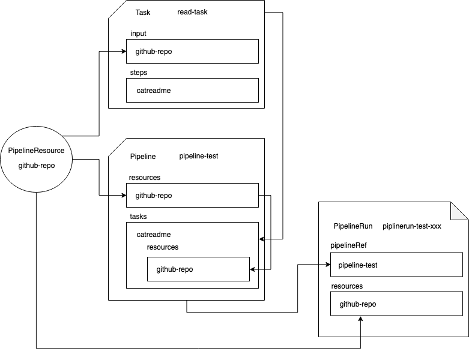

# tekton-examples

A practice repo to collect examples of using tekton with kubernetes.

Please note, this is just a reference for practicing with, this is not necessarily production ready.

** Information on how to run the examples are below the references **

## Tekton setup notes

These steps were taken and tweaked from this source:

[https://github.com/tektoncd/pipeline/blob/master/docs/install.md](https://github.com/tektoncd/pipeline/blob/master/docs/install.md)

Setup some environment variables:

    export CLUSTER_NAME=tekton-prac
    export CLUSTER_ZONE=europe-west4-a
    export NUM_NODES=2

Check values are set:

    echo $CLUSTER_NAME && echo $CLUSTER_ZONE && echo $NUM_NODES

Create the gc cluster:

    $ gcloud container clusters create $CLUSTER_NAME --zone=$CLUSTER_ZONE --num-nodes=$NUM_NODES

    $ gcloud container clusters list

To delete the cluster (if you want to start from scratch again):

    $ gcloud container clusters delete $CLUSTER_NAME

Grant cluster-admin permissions to the current user:

    $ kubectl create clusterrolebinding cluster-admin-binding \
    --clusterrole=cluster-admin \
    --user=$(gcloud config get-value core/account)

Install Tekton Pipelines:

    $ kubectl apply --filename https://storage.googleapis.com/tekton-releases/pipeline/latest/release.yaml

Check installed:

    $ kubectl get pods --namespace tekton-pipelines

You should see some pods in the "tekton-pipelines" namespace:

    tekton-pipelines-controller-...
    tekton-pipelines-webhook-...

## Notes on Tekton

Tekton is made up of **6 main components**:

* Step 

    run commands

* Task 

    list of steps

* Pipeline 

    graph of tasks

* Pipeline Resource 

    a resource that is declared and then referenced and used in tasks and pipelines

* Task Run 

    invoke a task  

* Pipeline Run

    invoke a pipeline

#### Useful Youtube Videos:

[https://www.youtube.com/watch?v=V0LpYdnTpsg](https://www.youtube.com/watch?v=V0LpYdnTpsg)

[https://www.youtube.com/watch?time_continue=691&v=Bt-4LOkXJLU&feature=emb_logo](https://www.youtube.com/watch?time_continue=691&v=Bt-4LOkXJLU&feature=emb_logo)

#### References:

[https://github.com/tektoncd/pipeline/blob/master/docs/install.md](https://github.com/tektoncd/pipeline/blob/master/docs/install.md)

[https://github.com/tektoncd/pipeline/blob/master/docs/tutorial.md](https://github.com/tektoncd/pipeline/blob/master/docs/tutorial.md)

[https://github.com/tektoncd/pipeline/tree/master/examples](https://github.com/tektoncd/pipeline/tree/master/examples)

[https://github.com/tektoncd/dashboard](https://github.com/tektoncd/dashboard)

# Dashabord

### Setup the dashboard for visibility 

Notes on setting up the dashboard:

Install the dashboard with this command:

    $ kubectl apply --filename https://github.com/tektoncd/dashboard/releases/download/v0.2.1/dashboard-latest-release.yaml

Note - Command taken from this source: [https://github.com/tektoncd/dashboard](https://github.com/tektoncd/dashboard)

Simplest way to access the dashboard locally, use port-forward

First check the dashboard pod is running:

    $ kubectl get pods --namespace tekton-pipelines

Find the dashboard pod:

    tekton-dashboard-xxx-xxx

View the dashboard by using port-forward:

    $ kubectl port-forward tekton-dashboard-xxx-xxx -n tekton-pipelines  9097:9097

You should now be able to view the dashboard at:

[http://localhost:9097](http://localhost:9097)

# Examples

These examples are assuming you have made a clone of this repo, or at least copied the files and structured them like they are in this repo.

## Example 1

A simple github read process

Run a simple example where you will set a public github repo as a **Pipeline Resource**. 

Some more notes:

A **task** will pull this repo into an ubuntu image and using the **Pipeline Resource** as an input.
The pipeline will list the task and also map in the **Pipeline Resource** as input.

Run these yaml scripts in this order:

    $ kubectl create -f ./example-github-read/

Some gotchas:

- Only run the pipelinerun once all the resources have successfully been created

    $ kubectl get pipeline,pipelineresource,task

You should see these resources

    NAME                                AGE
    pipeline.tekton.dev/pipeline-test   1m

    NAME                                      AGE
    pipelineresource.tekton.dev/github-repo   1m

    NAME                        AGE
    task.tekton.dev/read-task   1m

Check the dashboard:

[http://localhost:9097/#/namespaces/default/pipelineruns/pipelinerun-test](http://localhost:9097/#/namespaces/default/pipelineruns/pipelinerun-test)

Creating the PipelineRun

If you try run a PipelineRun as a single yaml script, for example:

    $ kubectl create -f ./example-github-read/pipeline-run.yaml 

The first time it will create and run fine. On the second attempt you will get an error.

The PipelineRun is the trigger, so you would keep the trigger seperate from the configuration/setup.

If we relooked this example a bit we ran these setup steps all at once:

    $ kubectl create -f ./example-github-read/resource.yaml
    $ kubectl create -f ./example-github-read/task.yaml
    $ kubectl create -f ./example-github-read/pipeline.yaml 

Then every time we want to trigger the pipeline we would need to have a unique named PipelineRun.

### PipelineRuns

Here are some ideas on how to tackle the pipeline run:

You can manually use the dashboard to trigger the PipelineRuns by going to the "pipelineruns" tab and clicking "Create PipelineRun".

Or we can generate the pipeline run dynamically using a name + timestamp approach:

    cat <<EOF >./pipeline-run-$(date +%s).yaml
    apiVersion: tekton.dev/v1alpha1
    kind: PipelineRun
    metadata:
      name: pipelinerun-test-$(date +%s)
    spec:
      pipelineRef:
        name: pipeline-test
      resources:
        - name: github-repo
          resourceRef:
            name: github-repo
    EOF

You would then need to create that PipelineRun  script:

    $ kubecl create -f pipeline-run-xxxxx.yaml

An approach I felt worked better:

You can dynamically create PipelineRuns using the "kubectl create" command directly, this will just create the kubernetes resource and run it but not save a file:

    cat <<EOF | kubectl create -f -
    apiVersion: tekton.dev/v1alpha1
    kind: PipelineRun
    metadata:
      name: pipelinerun-test-$(date +%s)
    spec:
      pipelineRef:
        name: pipeline-test
      resources:
        - name: github-repo
          resourceRef:
            name: github-repo
    EOF

Response Example:

    pipelinerun.tekton.dev/pipelinerun-test-1574241433 created

Going forwards in these examples I'm going to stick with the dynamic approach.

### Review Example 1

Now that you have run through an example, let's quickly visualise the Tekton flow we created:

./images/TektonExample1.png

